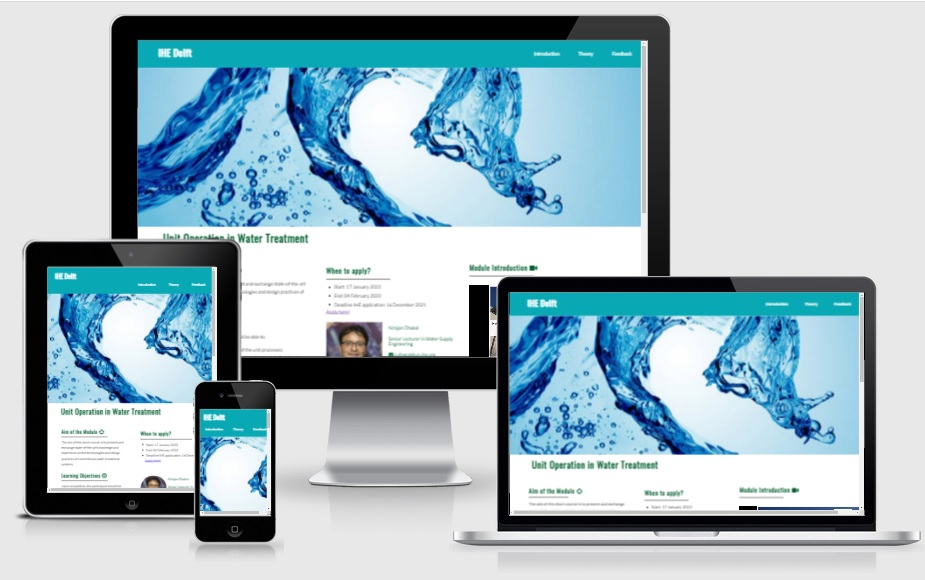

# Unit Operation in Water Treatment 
Welcome! [IHE Delft](http://un-ihe.org)
## Introduction
The overall aim of this project is to make module "unit operation in Water Treatment" online. This module is a course with 5 ECTS within the chair group of Water Supply Engineering at IHE Delft.

A live website can be found [here](https://dhakal79.github.io/Portfolio-project-MS1/).

## Table of Contents 

# Table of Contents
 [1. User Expereince (UX) design](#ux)
  - [User Goals:](#user-goals)
  - [User Expectations:](#user-expectations)
  - [Site Design Strategy](#site-strategy)
  -	[Colour scheme and font](#color-scheme)
  - [Audio/video controls](#audio-video)
  - [Site skeleton (wireframes)-3 pages](#wireframes)
    - [Introduction page](#introduction-page)
    - [Theory page](#theory-page)
    - [Feedback page](#feedback-page)

      
  [2. Features](#features)

  [3.Technologies used](#technologies-used)

  [4.Testing](#testing)

  [5. Deployment](#deployment)

  [6. End products](#end-products)

  [7. Acknowledgement](#acknowledgement)

  
# 1. User Expereince (UX) design
  [Go to the top](#table-of-contents)

## User Goals
  [Go to the top](#table-of-contents)

## User Expectations
  [Go to the top](#table-of-contents)

## Site Strategy
  [Go to the top](#table-of-contents)

## Color Scheme
  [Go to the top](#table-of-contents)

## Audio-Video
  [Go to the top](#table-of-contents)

## Site Skeleton
  [Go to the top](#table-of-contents)
	

### Introduction Page
  [Go to the top](#table-of-contents)
	

### Theory Page
  [Go to the top](#table-of-contents)

### Feedback Page
  [Go to the top](#table-of-contents)

  
# 2. Features
  [Go to the top](#table-of-contents)
 
   
# 3. Technologies Used
  [Go to the top](#table-of-contents)

  
# 4. Testing
  [Go to the top](#table-of-contents)

  
# 5. Deployment
  [Go to the top](#table-of-contents)

  
# 6. End Products
  [Go to the top](#table-of-contents)

  
# 7. Acknowledgement
  [Go to the top](#table-of-contents)

  

### Project Goals

The main goal of this website is to make module "unit operation in water treatment" online for student who would like to follow the course from distance. 

## Skeleton
[Balsamiq](https://balsamiq.com/) was used to create wireframes of the website. This was very useful as it gives the template of the UI. Wireframes were designed for web browser and a mobile browser format. The concept design (wireframes) of webpages (3 pages) prepared is presented below.

### Wire-frames
Web browser Introduction page
